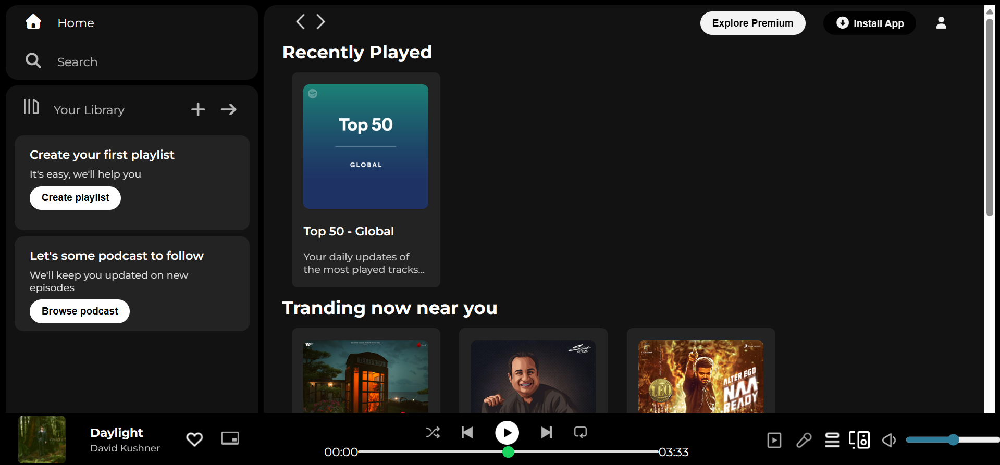

# 🎧 Spotify Clone

A simple **Spotify UI Clone** built using **HTML and CSS**.  

This project replicates the basic layout of Spotify including sidebar, playlists, and music player UI.

<br>

# 🚀 Live Demo

🌐 **View Live Project:**  
https://spotify-clone-page.netlify.app

<br>


#  Screenshot

##  Home Page



<br>
<br>


# 🛠️ Tech Stack

| Technology | Purpose |
|------------|--------|
| HTML5 | Structure |
| CSS3 | Styling |

<br>
<br>


# ⚙️ Installation

### Clone the repository

```bash
git clone https://github.com/ketanmakwana30/spotify-clone.git

```
### Navigate to Project Folder

```bash
cd spotify-clone
```
### Open the Project

Open the index.html file in your browser.


<br>


# Author

Ketan Makwana

GitHub: https://github.com/ketanmakwana30

Live Project: https://spotify-clone-page.netlify.app
